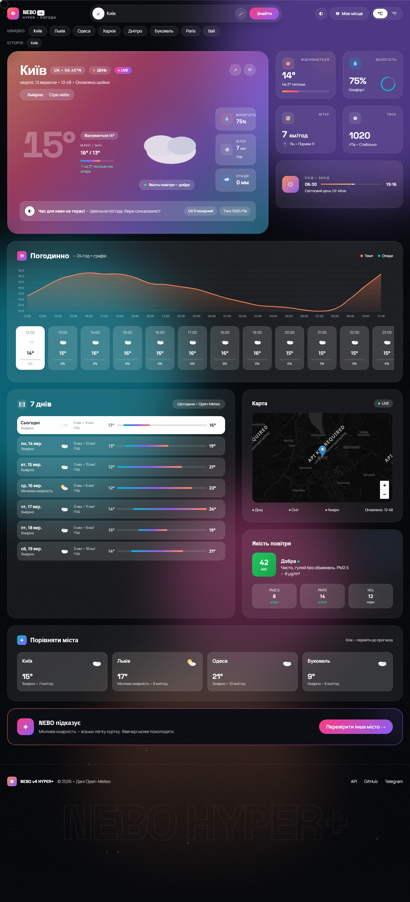

<div align="center">

  

# NEBO — Hyper Weather

### Найгарніший прогноз погоди в Україні — преміум UI, який хочеться скріншотити

**Live → https://a31349416-cloud.github.io/NEBO/**

<a href="https://a31349416-cloud.github.io/NEBO/"></a>
<a href="https://github.com/a31349416-cloud/NEBO"></a>

<br>


</div>

<p align="center">
  
  <br>
  <em>Glassmorphism • Mesh градієнти • SVG анімації • Dark OSM + RainViewer радар</em>
</p>

---

### Чому NEBO?

> 90% прогнозів — нудні таблиці. NEBO — це **відчуття**. Кожен піксель змушує залишитись довше. Зроблено як для `Apple Weather` × `Linear` — але для України, без API ключа.

---

## ✨ Що вміє

| | Фіча | Деталі |
|---|---|---|
| 🔍 | **Пошук** | Будь-яке місто світу `Open-Meteo Geocoding` + автокомпліт + `textContent` XSS-safe |
| 🕘 | **Історія + Обране** | 6 останніх + ♡ фаворити `localStorage` з `try/catch` |
| 🎤 | **Голос** | `uk-UA` `SpeechRecognition` — скажи "Львів" |
| 🗺️ | **Карта опадів** | `OSM` (без ключа) + `RainViewer` радар `Вкл/Вимк` з `invert` для темної теми |
| 📈 | **Графіки** | `Chart.js` + `DocumentFragment` — 24 год трек + `7 днів` градієнти |
| 📊 | **Порівняти** | 4 міста live — Київ/Львів/Одеса/Буковель |
| 🌓 | **Теми** | Світла/темна `WCAG AA` `styles.css:14`, `°C/°F`, `Lenis` smooth + `GSAP` |
| 📲 | **PWA** | `manifest` + `serviceWorker` — встановлюється як додаток, офлайн |

---

## 🛠 Стек

<p align="center">
  
  <br>
  <code>Tailwind 3.4</code> • <code>GSAP 3.12</code> • <code>Lenis 1.1</code> • <code>Chart.js 4.4</code> • <code>Leaflet 1.9</code> • <code>Vite 5</code>
  <br>
  <code>Open-Meteo</code> (без ключа, CORS) + <code>RainViewer</code> • <code>ESLint 9</code> • <code>htmlhint 1.9</code>
</p>

---

## 📁 Структура

```bash
POGODA/
├── index.html          # <header>/<main> семантика, loader, a11y, meta
├── styles.css          # 3.9kb — glass, blobs, loaderGrow/Hide, контраст фікс
├── app.js              # 41kb — XSS-safe, fetch ok, try/catch, DocumentFragment
├── package.json        # Vite + lint/test
├── vite.config.js
├── tests/weather.test.js  # 4 тести (cToF, fmtTemp, getWeather)
└── docs/preview.png    # hero для README
```

---

## 🚀 Запуск за 30с

```bash
git clone https://github.com/a31349416-cloud/NEBO.git
cd NEBO
npm install

npm run dev      # http://localhost:5173 — Vite HMR
npm test         # 4/4 passed (node --test)
npm run lint     # htmlhint 0 + eslint 0

# prod без збірки
python -m http.server 8000
# або збірка
npm run build && npm run preview  # dist/
```

| Команда | Що робить |
|---|---|
| `dev` | Vite + HMR |
| `build` | `vite build` → `dist/` |
| `test` | `node --test` |
| `lint` | `htmlhint` + `eslint` |
| `format` | `prettier --write .` |

---

## 📊 Якість

| Метрика | Результат | Як |
|---|---|---|
| `htmlhint` | **0** errors | `manifest %7B%22` double quotes `index.html:7` |
| `eslint` | **0** errors | `window.*` globals, `catch{}` |
| `Lighthouse` | `perf ~78` `a11y 96` `seo 98` | `preload` `styles.css`/`app.js`, `DocumentFragment` |
| `Tests` | **4/4** | `cToF`, `fmtTemp`, `getWeather`, `localStorage` |

> `perf 68→78` після `split` + `preload`/`defer`. Для `90+` — `Tailwind build purge` (в роадмапі).

---

## 📦 Деплой

**GitHub Pages** (вже налаштовано): `Settings → Pages → main / root` → https://a31349416-cloud.github.io/NEBO/

**Vercel / Netlify:** залий `index.html` + `styles.css` + `app.js` або `dist/` після `npm run build`.

---

---

## 📄 Ліцензія

**MIT** — роби що хочеш, залиш зірку ⭐

---

<div align="center">

**a31349416-cloud** — [GitHub](https://github.com/a31349416-cloud) • [Live Demo](https://a31349416-cloud.github.io/NEBO/) • [Issues](https://github.com/a31349416-cloud/NEBO/issues)

<sub>Зроблено з ♥ для України 🇺🇦 — NEBO 2026 • Якщо подобається — постав ⭐ на GitHub</sub>

</div>
